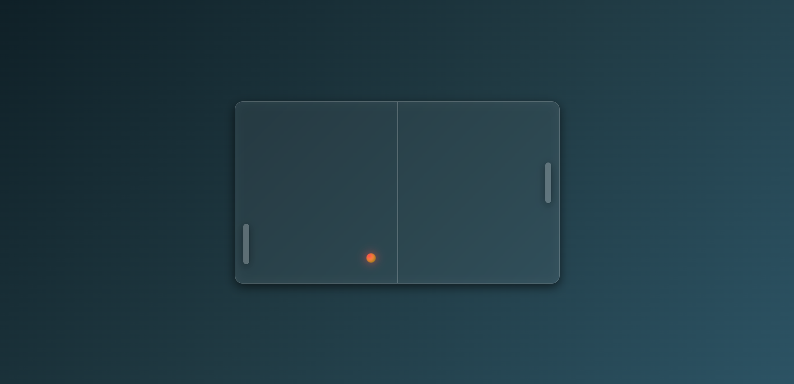

# 🏓 Ping Pong Game

A simple glassmorphic **Ping Pong game** built with **HTML, CSS, and JavaScript**.  
Play with **Arrow Keys** (left paddle) and **W / S keys** (right paddle).  

## 🚀 Features
- Glassmorphic UI 🎨
- Smooth paddle controls ⬆️⬇️
- Ball bounce mechanics ⚡
- Keyboard + Mouse support for paddles 🎮

## 🎯 Controls
- **Left Paddle** → `Arrow Up / Arrow Down`
- **Right Paddle** → `W / S`
- **Mouse** → Move left paddle

## 📸 Preview

## 🌐 Live Demo
👉 [Play here](https://your-username.github.io/ping-pong-game/)

## 🛠️ Tech Stack
- HTML
- CSS
- JavaScript

---

